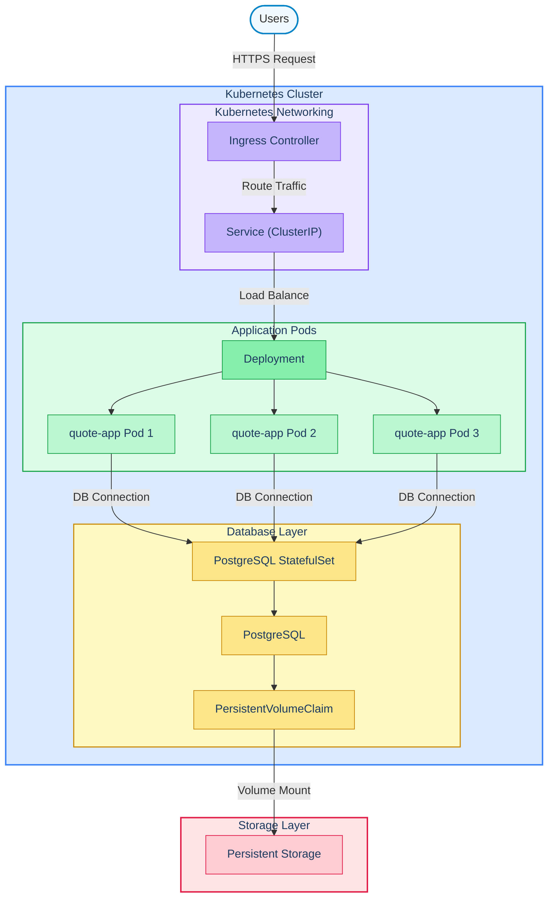

# Architecture Finale – Quote API

## Current System Problems

### 1. Application et base de données dans le même conteneur

**Problème**

L’APP Quote et la base de données PostgreSQL sont exécutées dans le même conteneur et dans le même pod.

**Pourquoi c’est un problème**

Dans Kubernetes, il est recommandé de séparer les composants ayant des rôles différents. L’application et la base de données ont des besoins différents en ressources, en gestion du cycle de vie et en scalabilité.

Les exécuter ensemble empêche de les gérer indépendamment.

**Risque**

Si le pod redémarre ou tombe en panne, l’API et la base de données s’arrêtent en même temps. Cela crée un point unique de défaillance et peut provoquer une indisponibilité du service.

---

### 2. Secrets stockés en clair

**Problème**

Les identifiants de la base de données sont stockés en texte clair dans les variables d’environnement.

**Pourquoi c’est un problème**

Les informations sensibles doivent être stockées dans des **Kubernetes Secrets** afin de limiter leur exposition.

Les variables en clair peuvent apparaître dans les logs ou dans les fichiers de configuration.

**Risque**

Fuite de données sensibles ou accès non autorisé à la base de données.

---

## Production Architecture

L’architecture proposée vise à améliorer la fiabilité, la sécurité et la scalabilité du système.

### Couche application

L’APP Quote est déployée à l’aide d’un **Deployment Kubernetes** avec plusieurs réplicas (par exemple 3 pods).

Cela permet de garantir la disponibilité de l’application et de répartir la charge entre plusieurs instances.

### Réseau

Les utilisateurs accèdent à l’application via un **Ingress** qui redirige les requêtes vers un **Service Kubernetes** de type ClusterIP.

Le Service agit comme un point d’accès stable et répartit le trafic entre les pods.

### Base de données

PostgreSQL est déployé séparément dans un **StatefulSet** afin de gérer correctement l’état et l’identité du pod.

Un **PersistentVolumeClaim** est utilisé pour garantir la persistance des données.

### Sécurité

Les identifiants de connexion à la base de données sont stockés dans des **Kubernetes Secrets**.

### Surveillance de l’état

Des **readiness probes** et **liveness probes** sont configurées pour vérifier que les pods fonctionnent correctement.

### Gestion des ressources

Chaque conteneur définit :

- des **CPU requests**
- des **CPU limits**
- des **memory requests**
- des **memory limits**

Cela permet de garantir un fonctionnement stable dans un cluster partagé.

---

## Architecture Diagram

Exemple simplifié de l’architecture :

## Operational Strategy

### Scalabilité

L’application fonctionne avec plusieurs réplicas gérés par un **Deployment Kubernetes**.

Le Service répartit automatiquement les requêtes entre les pods.

Si la charge augmente, le nombre de réplicas peut être augmenté manuellement ou automatiquement avec un **Horizontal Pod Autoscaler (HPA)**.

---

### Déploiements sécurisés

Les mises à jour sont effectuées avec une stratégie **Rolling Update**.

Kubernetes crée de nouveaux pods avec la nouvelle version avant de supprimer les anciens.

Cela permet d’éviter toute interruption de service.

---

### Détection des pannes

Les pannes sont détectées grâce aux probes Kubernetes :

- **Liveness probe** : redémarre un conteneur bloqué
- **Readiness probe** : empêche l’envoi de trafic vers un pod non prêt

---

### Récupération automatique

Plusieurs contrôleurs Kubernetes assurent la stabilité du système :

**Deployment Controller**

Maintient le nombre souhaité de pods.

**ReplicaSet**

Recrée automatiquement les pods supprimés ou défaillants.

**StatefulSet**

Gère l’identité stable et le stockage persistant pour PostgreSQL.

Ces mécanismes permettent au système de se rétablir automatiquement après certaines pannes.

---

## Weakest Point

Le point le plus fragile de cette architecture reste la base de données PostgreSQL.

Même avec un stockage persistant, la base de données reste un composant critique. Si elle devient indisponible, l’API ne pourra plus fonctionner correctement.

Pour améliorer la résilience, il serait possible d’ajouter :

- une réplication PostgreSQL
- des sauvegardes automatiques
- ou un service de base de données managé

Ces améliorations permettraient d’augmenter la fiabilité globale du système.